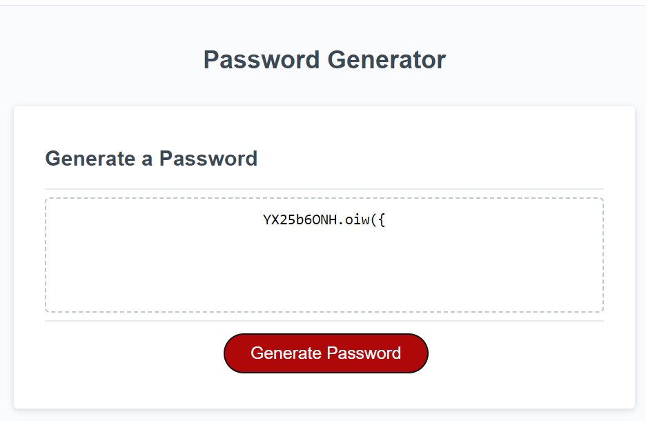

# JavaScript: Password Generator

## Overview
This JavaScript project was created in order to show my ability to work with JavaScript code, EDX provided the starter code to which i had to add and improve to make this into a functional Password Generator.

As my second JavaScript assignment i had to use what had been taught/ provided by EDX in the second week to code a Password Generator.

Prior to adding any of my own code i was provided with the starter files.

The Password Generator which i was tasked to code is to be used to generate a unique password based on a set of inputs from the user. Before any password will be generated the user must answer the following:

- ***Length of password*** - The password length must be between 8 - 128 characters.
- ***Numeric values*** - User can choose if they want numbers in the password.
- ***Special chracters*** - User can choose if they want special characters in the password.
- ***UpperCase chracters*** - User can choose if they want upperCase characters in the password.
- ***LowerCase characters*** - User can choose if they want lowerCase chracters in the password.

Once the following information has been gathered a password will be generated at displayed.

 
Some considerations beforehand and during the development. 

- ***Clean and consistant Code*** -Clean code with useful naming conventions.
- ***Code Reusablitiy*** - Provide code which is DRY, reusing existing code to form new functions.
- ***Plan Code*** - Think about what will be required ahead of coding, plan what variables, methods and concepts to adopt in code before writting any code.
   
  &nbsp;&nbsp;&nbsp;&nbsp;&nbsp;&nbsp;-This can be see by in the "PseudoCode.txt file which is attached within this project.
 
 

**Why was this project built**
  &nbsp;&nbsp;&nbsp;&nbsp;&nbsp;&nbsp;
  1. To allow people/ employers the ability view my understanding of more advanced JavaScript.
   
  1. To demonstrate my ability in using more difficult concepts in JavaScript however limited the teaching has been.
   
  1. To gauge my understanding of JavaScript to identify areas for improvement for further projects in the future.
 
 
  **The problems that where solved in this project**
 
 1. The ability to understand and use JavaScript, working with new concepts within the JavaScript language.  
 2. Using functions, Scope, Hoisiting, variables, arrays, if statements, if-else statements, for-loops and array methods to obtain and extraction information to provide a useful output.
 3. To take information from arrays and manlipulate them with methods to output information that will displayed as a unique genrated password.
   
 

**What did you learn?** 
  
  1. I leant how to declare variables, setup arrays, use loops, if-statements, scope, hoisting, functions and how i can combine these to output useful information.
    
  1. Using Pseudocode to help plan and break down a task into smaller segments.
    
  1. Pair programming and how working with another developer can help gain a new prospective on tasks/ methods.

## Table of Contents

- [JavaScript: Password Generator](#javascript-password-generator)
  - [Overview](#overview)
  - [Table of Contents](#table-of-contents)
  - [Installation](#installation)
  - [Live Site](#live-site)
  - [JavaScript Password Generator Project and Source code on Github](#javascript-password-generator-project-and-source-code-on-github)
  - [Usage](#usage)
    - [Instructions on how to use Password Generator:](#instructions-on-how-to-use-password-generator)
  - [Credits](#credits)
  - [License](#license)

## Installation

**Using Git to create a copy/ clone of website.**

1. Open either Git Bash (Windows) or Terminal (MacOS) and the following commands to create a copy of the website.
   
2. Create a folder/ directory to store website folders/ files within it use the following command 
  &nbsp;&nbsp;&nbsp;&nbsp;&nbsp;&nbsp; -
 ` mkdir "folder name"` 

1.  Navgate into folder using following command. 
  &nbsp;&nbsp;&nbsp;&nbsp;&nbsp;&nbsp; -
  `cd "folder name"` 

1. To make a copy/ clone of the website inside of the folder/ directory use the following command 
  &nbsp;&nbsp;&nbsp;&nbsp;&nbsp;&nbsp; -
  `git clone git@github.com:serk03/Password-Generator.git`
  
1. Navigate inside of your folder/ directory that you copied using the following commands. 
&nbsp;&nbsp;&nbsp;&nbsp;&nbsp;&nbsp; -
  `cd "folder/ directory name"`

1. To view the folder/ files from the website inside a VS Code using the following command. 
&nbsp;&nbsp;&nbsp;&nbsp;&nbsp;&nbsp; -
  `code .`

1. Open the files you would like to view using the following command. 
&nbsp;&nbsp;&nbsp;&nbsp;&nbsp;&nbsp; 
  -index.html - right and select open with default browser, will open the website in your default browser.
   
&nbsp;&nbsp;&nbsp;&nbsp;&nbsp;&nbsp; 
 -Double click on either index.html/ index.js to view code that has been used to create website structure (index.html) and javascript (index.js).

 

## Live Site
- To view the live/ active website please click on the following link: [View Live JavaScript Password Generator Project](https://serk03.github.io/Password-Generator/)

## JavaScript Password Generator Project and Source code on Github
- To view the repository and its source code please visit Github by clicking on the following link: [View Github Repository](git@github.com:serk03/Password-Generator.git)

## Usage

### Instructions on how to use Password Generator:

**Instructions on Active/ Live Site**
  - Click on ***"Generate Password"*** button.
  - ***Password Length***- Choose the length of the password you would like, password length must be greater than 8 and cannot be more than 128.
   ***Numerical values on can be used no text values***
  - ***Special Character*** - If you would like special characters in the password click on "OK" otherwise click "Cancel"
  - ***Numerical Character*** - If you would like numerical characters in the password click on "OK" otherwise click "Cancel"
  - ***UpperCase Character*** - If you would like Uppercase characters in the password click on "OK" otherwise click "Cancel"
  - ***LowerCase Character*** - If you would like lowercase characters in the password click on "OK" otherwise click "Cancel"
 
&nbsp;&nbsp;&nbsp;&nbsp;&nbsp;&nbsp; 

**VS CODE**
- To view the source code of the JavaScript open the cloned repo folder in your choosen code editor and doubled click on the index.js from the JS folder.

## Credits

Author of Project - Serkan Onal

Assistance/ Collaboration and pair programming on this project was provided by Tudor Tocan during tutoring session.

## License

No Licenses where used or applied to this website.

